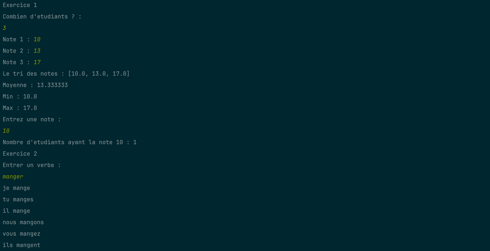
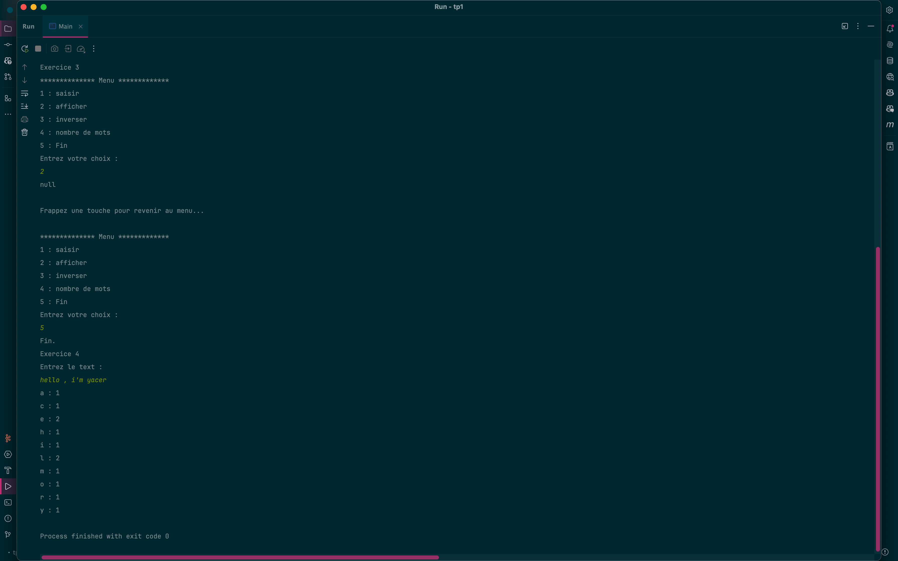

# Unified Java Exercises

This project is a collection of various Java exercises unified under a single entry point. It consists of a main `Main`
class that orchestrates the execution of exercises from different packages.

## Table of Contents

- [Exercises](#exercises)
- [Main Entry Point](#main-entry-point)
- [Code results](#code-results)
- [Exercises link](#exercises-link)
- [Prerequisites](#prerequisites)

## Exercises

- **Exercise 1**: Notes Management System
- **Exercise 2**: Conjugation System
- **Exercise 3**: String Manipulation System
- **Exercise 4**: Letter Occurrences System

## Main Entry Point

### Main

The central `Main` class is responsible for running all the exercises sequentially. It invokes the `main` method of each
exercise.

```java
package org.example;

public class Main {
    public static void main(String[] args) {
        System.out.println("Exercice 1");
        org.example.ex1.Main.main(args);
        System.out.println("Exercice 2");
        org.example.ex2.Main.main(args);
        System.out.println("Exercice 3");
        org.example.ex3.Main.main(args);
        System.out.println("Exercice 4");
        org.example.ex4.Main.main(args);
    }
}
```

## Code results


***


Exercise 1: Notes Management System

1. Prompt for the number of students: The user inputs 3.
2. Prompt for each student's note: The user inputs 10, 13, and 17.
3. Display sorted notes: [10.0, 13.0, 17.0].
4. Calculate and display the average: 13.333333.
5. Display the minimum note: 10.0.
6. Display the maximum note: 17.0.
7. Prompt for a note to search: The user inputs 10.
8. Display the count of students with the note 10: 1.

***
Exercise 2: Conjugation System

1. Prompt for a verb: The user inputs manger.
2. Display conjugation for the verb manger:
    - je mange
    - tu manges
    - il mange
    - nous mangons
    - vous mangez
    - ils mangent

***
Exercise 3: String Manipulation System

1. Display a menu:
    - 1: saisir (input)
    - 2: afficher (display)
    - 3: inverser (reverse)
    - 4: nombre de mots (word count)
    - 5: Fin (end)
2. Prompt for a choice: The user inputs 2.
3. Display the result of the choice: null (likely because no string was inputted before).
4. Prompt to return to the menu.
5. Display the menu again.
6. Prompt for a choice: The user inputs 5.
7. End the exercise: Fin.

***
Exercise 4: Letter Occurrences System

1. Prompt for text input: The user inputs hello , i'm yacer.
2. Display the count of each letter:
    - a: 1
    - c: 1
    - e: 2
    - h: 1
    - i: 1
    - l: 2
    - m: 1
    - o: 1
    - r: 1
    - y: 1

***
Final Output
The program finishes with an exit code 0, indicating successful execution

## Exercises link

- [Exercise 1](src/main/java/org/example/ex1/readme.md)
- [Exercise 2](src/main/java/org/example/ex2/readme.md)
- [Exercise 3](src/main/java/org/example/ex3/readme.md)
- [Exercise 4](src/main/java/org/example/ex4/readme.md)

### Prerequisites

- Java Development Kit (JDK) 17 or higher.
- IDE such as IntelliJ IDEA.

### Running the Program

1. Clone the repository to your local machine.
2. Open the project in your preferred IDE.
3. Compile and run the central `Main` class.
4. The program will sequentially execute each exercise: Notes Management System, Conjugation System, String Manipulation
   System, and Letter Occurrences System.
