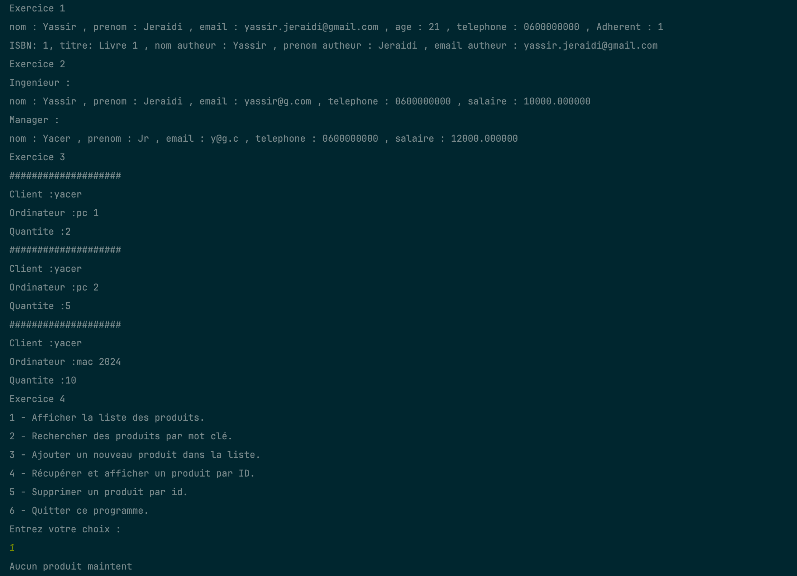

# Unified Java Exercises

This project is a collection of various Java exercises unified under a single entry point. It consists of a main `Main`
class that orchestrates the execution of exercises from different packages.

## Table of Contents

- [Exercises](#exercises)
- [Main Entry Point](#main-entry-point)
- [Code Results](#code-results)
- [Exercises link](#exercises-link)
- [Prerequisites](#prerequisites)

## Exercises

- **Exercise 1**: Library Management System
- **Exercise 2**: Employee Salary Management System
- **Exercise 3**: Computer Sales Management System
- **Exercise 4**: Product Collection Management Using Lists and Interfaces

## Main Entry Point

### Main

The central `Main` class is responsible for running all the exercises sequentially. It invokes the `main` method of each
exercise.

```java
package org.example;

public class Main {
    public static void main(String[] args) {
        System.out.println("Exercice 1");
        org.example.ex1.Main.main(args);
        System.out.println("Exercice 2");
        org.example.ex2.Main.main(args);
        System.out.println("Exercice 3");
        org.example.ex3.Main.main(args);
        System.out.println("Exercice 4");
        org.example.ex4.Application.main(args);
    }
}
```

## Code Results



- Exercice 1 :
  This exercise appears to be a Library Management System. The output shows details of an Adherent (member) and a
  Livre (book):
    - Adherent:
        - Name: Yassir Jeraidi
        - Email: yassir.jeraidi@gmail.com
        - Age: 21
        - Phone: 0600000000
        - ID: 1
    - Livre:
        - ISBN: 1
        - Title: Livre 1
        - Author: Yassir Jeraidi
        - Author's Email: yassir.jeraidi@gmail.com

***

- Exercice 2 :
  This exercise appears to be an Employee Salary Management System. The output shows details of an Employee:
    - Ingenieur:
        - Name: Yassir Jeraidi
        - Email: yassir@g.com
        - Phone: 0600000000
        - Salary: 10000.00
    - Manager:
        - Name: Yacer Jr
        - Email: y@g.c
        - Phone: 0600000000
        - Salary: 12000.00

***

- Exercice 3 :
  This exercise appears to be a Computer Sales Management System. The output shows details of sales transactions:
    - Client : yacer
        - Ordinateur: pc 2
        - Quantity: 5
    - Client: yacer
        - Ordinateur: pc 2
        - Quantity: 5
    - Client: yacer
        - Ordinateur: mac 2024
        - Quantity: 10

***

- Exercice 4 :
  This exercise is a Product Collection Management System using a menu-driven interface. The output shows the menu
  options and user interactions:
    - The menu is displayed with options to manage products.
    - The user chooses option 1 to display all products, but no products are present (Aucun produit maintent).
    - The menu is displayed again, and the user chooses option 6 to exit the program (fin de programme).

***

The program finishes successfully with exit code 0, indicating that it ran without errors.

## Exercises link

- [Exercise 1](src/main/java/org/example/ex1/readme.md)
- [Exercise 2](src/main/java/org/example/ex2/readme.md)
- [Exercise 3](src/main/java/org/example/ex3/readme.md)
- [Exercise 4](src/main/java/org/example/ex4/readme.md)

### Prerequisites

- Java Development Kit (JDK) 17 or higher.
- IDE such as IntelliJ IDEA.

### Running the Program

1. Clone the repository to your local machine.
2. Open the project in your preferred IDE.
3. Compile and run the central `Main` class.
4. The program will sequentially execute each exercise: Notes Management System, Conjugation System, String Manipulation
   System, and Letter Occurrences System.
