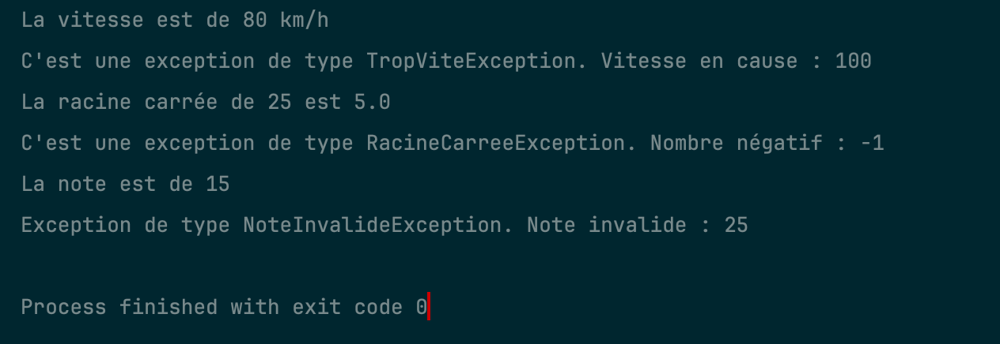

# Unified Java Exercises

This project is a collection of various Java exercises unified under a single entry point. It consists of a main Main class that orchestrates the execution of exercises from different packages.

## Table of Contents

- [Exercises](#exercises)
- [Main Entry Point](#main-entry-point)
- [Main Code Results](#main-code-results)
- [Exercises link](#exercises-link)
- [Prerequisites](#prerequisites)

## Exercises

- **Exercise 1**: Vehicle Speed Test
- **Exercise 2**: Square Root Calculator
- **Exercise 3**: Grade Evaluator

## Main Entry Point

### Main

The central `Main` class is responsible for running all the exercises sequentially. It invokes the `main` method of each exercise.

```java
public class Main {
    public static void main(String[] args) {
        System.out.println("Exercice 1 :");
        org.example.ex1.Vehicule.main(args);
        System.out.println("Exercice 2 :");
        org.example.ex2.Calculateur.main(args);
        System.out.println("Exercice 3 :");
        org.example.ex3.Evaluateur.main(args);
    }
}
```

## Main Code Results



The code result indicates the sequential execution of three exercises, each demonstrating custom exception handling in Java. Here is a breakdown of the output:
- Exercise 1: Vehicle Speed Test  
  - The speed of 80 km/h is within the limit, so it prints: La vitesse est de 80 km/h.
  - The speed of 100 km/h exceeds the limit, so it throws a TropViteException and prints: C'est une exception de type TropViteException. Vitesse en cause : 100.
  
- Exercise 2: Square Root Calculator  
  - The square root of 25 is calculated successfully, so it prints: La racine carrée de 25 est 5.0.
  - The number -1 is negative, so it throws a RacineCarreeException and prints: C'est une exception de type RacineCarreeException. Nombre négatif : -1.

- Exercise 3: Grade Evaluator  
  - The grade 15 is within the valid range, so it prints: La note est de 15.
  - The grade 25 is outside the valid range, so it throws a NoteInvalideException and prints: Exception de type NoteInvalideException. Note invalide : 25.
  
The message Process finished with exit code 0 indicates that the program terminated successfully without any unhandled exceptions.

## Exercises link

- [Exercise 1](src/main/java/org/example/ex1/readme.md)
- [Exercise 2](src/main/java/org/example/ex2/readme.md)
- [Exercise 3](src/main/java/org/example/ex3/readme.md)


### Prerequisites

- Java Development Kit (JDK) 17 or higher.
- IDE such as IntelliJ IDEA.

### Running the Program

1. Clone the repository to your local machine.
2. Open the project in your preferred IDE.
3. Compile and run the central `Main` class.
4. The program will sequentially execute each exercise: Notes Management System, Conjugation System, String Manipulation System, and Letter Occurrences System.
