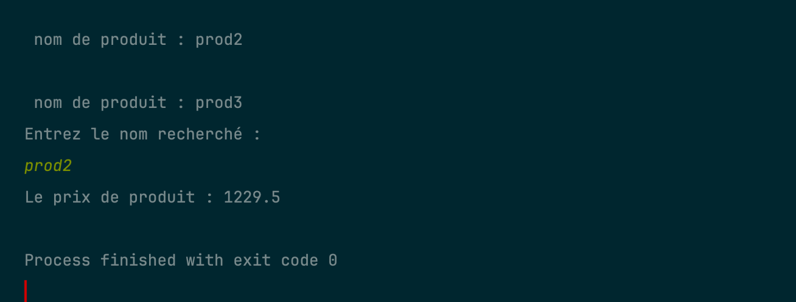
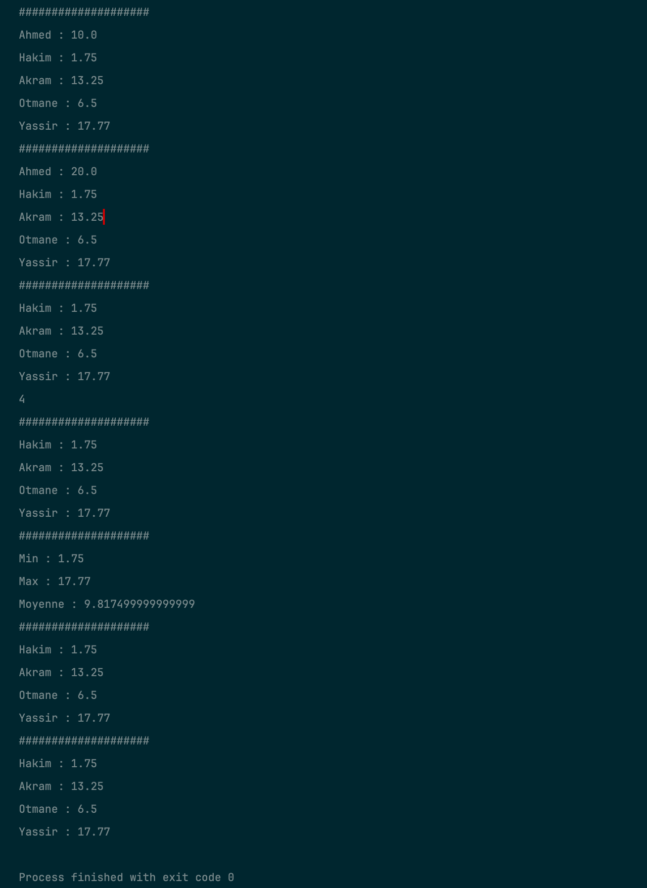
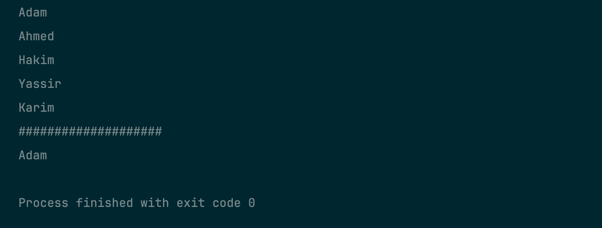
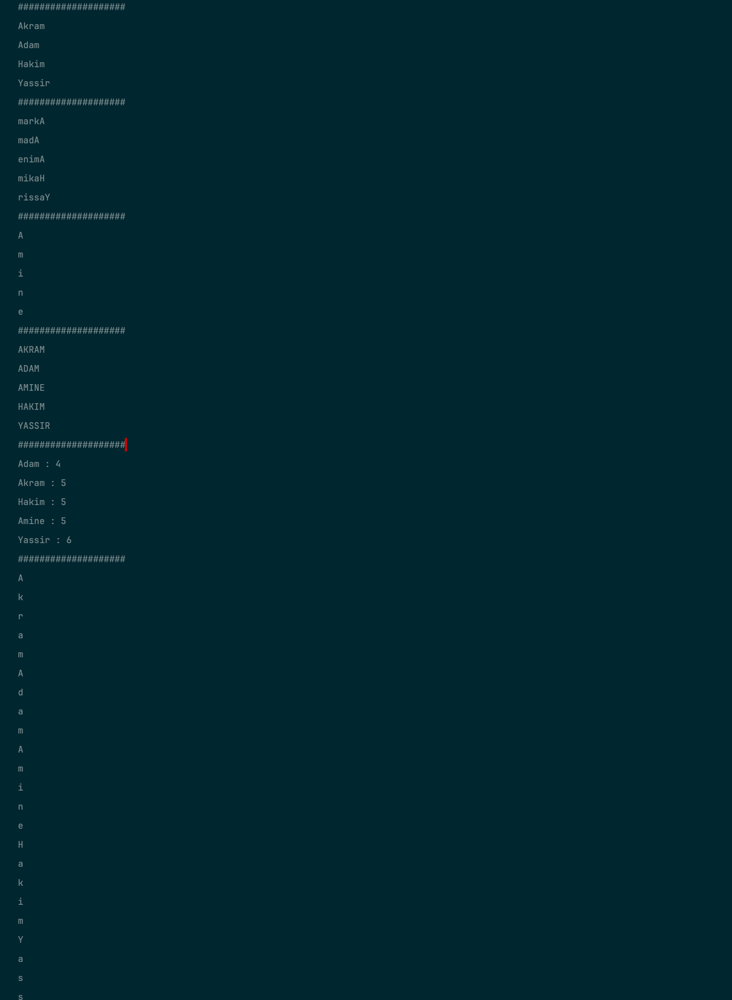
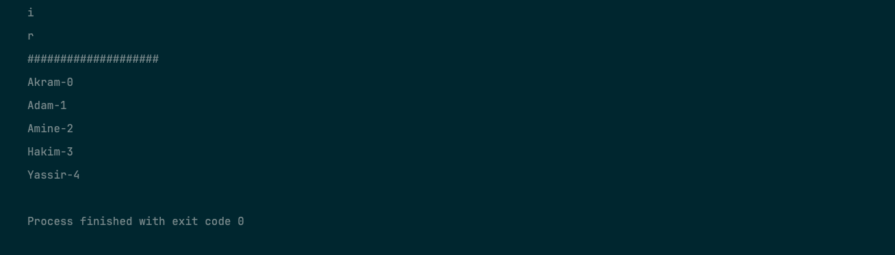
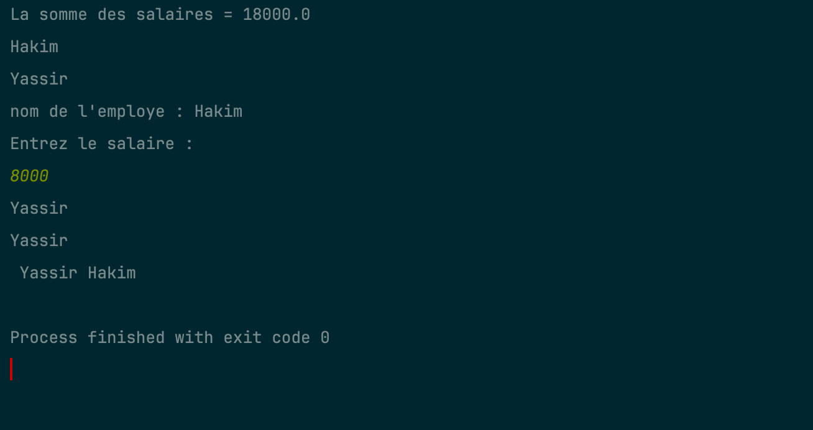

# Unified Java Exercises

This project is a collection of various Java exercises unified under a single entry point. It consists of a main Main class that orchestrates the execution of exercises from different packages.

## Table of Contents

- [Exercises](#exercises)
- [Main Entry Point](#main-entry-point)
- [Main Code Results](#main-code-results)
- [Exercises link](#exercises-link)
- [Prerequisites](#prerequisites)

## Exercises

- **Exercise 1**: Student Grades Management
- **Exercise 2**: Set Operations
- **Exercise 3**: Stream Operations on Names
- **Exercise 4**: Stream Operations on Employees
- **Exercise 5**: Product Management

## Main Entry Point

### Main

The central `Main` class is responsible for running all the exercises sequentially. It invokes the `main` method of each exercise.

```java
package org.example;

public class Main {
    public static void main(String[] args) {
        System.out.println("Collections : ");
        System.out.println("Exercice 1 : ");
        org.example.collections.ex1.GestionProduitsApp.main(args);
        System.out.println("Exercice 2 : ");
        org.example.collections.ex2.Main.main(args);
        System.out.println("Exercice 3 : ");
        org.example.collections.ex3.Main.main(args);
        System.out.println("Stream : ");
        System.out.println("Exercice 1 : ");
        org.example.streams.ex1.Main.main(args);
        System.out.println("Exercice 2 : ");
        org.example.streams.ex2.Main.main(args);
    }
}
```

## Main Code Results

### Collections

Exercise 1:

Exercise 2:

Exercise 3:


### Streams

Exercise 1:


Exercise 2:



- The code result indicates the sequential execution of five exercises, each demonstrating different Java collection and stream operations. Here is a breakdown of the output:
- **Collections**:
  - Exercise 1: Student Grades Management  
    - Manages a HashMap of student names and their grades, performing various operations such as insertion, update, deletion, and statistical calculations.
  - Exercise 2: Set Operations  
    - Demonstrates basic set operations (intersection and union) on two HashSet objects.
  - Exercise 3: Stream Operations on Names  
    - Performs several stream operations on a list of names, including filtering, mapping, and reducing.
- **Streams**:
  - Exercise 1: Stream Operations on Employees  
    - Performs several stream operations on a list of Employe objects, including sorting, filtering, and reducing.
  - Exercise 2: Product Management  
    - Manages a list of Produit objects, performing operations such as addition, deletion, modification, and searching.

The message Process finished with exit code 0 indicates that the program terminated successfully without any unhandled exceptions.

## Exercises link

### Collections
- [Exercise 1](src/main/java/org/example/collections/ex1/readme.md)
- [Exercise 2](src/main/java/org/example/collections/ex2/readme.md)
- [Exercise 3](src/main/java/org/example/collections/ex3/readme.md)

### Streams
- [Exercise 1](src/main/java/org/example/streams/ex1/readme.md)
- [Exercise 2](src/main/java/org/example/streams/ex1/readme.md)


### Prerequisites

- Java Development Kit (JDK) 17 or higher.
- IDE such as IntelliJ IDEA.

### Running the Program

1. Clone the repository to your local machine.
2. Open the project in your preferred IDE.
3. Compile and run the central `Main` class.
4. The program will sequentially execute each exercise: Notes Management System, Conjugation System, String Manipulation System, and Letter Occurrences System.
