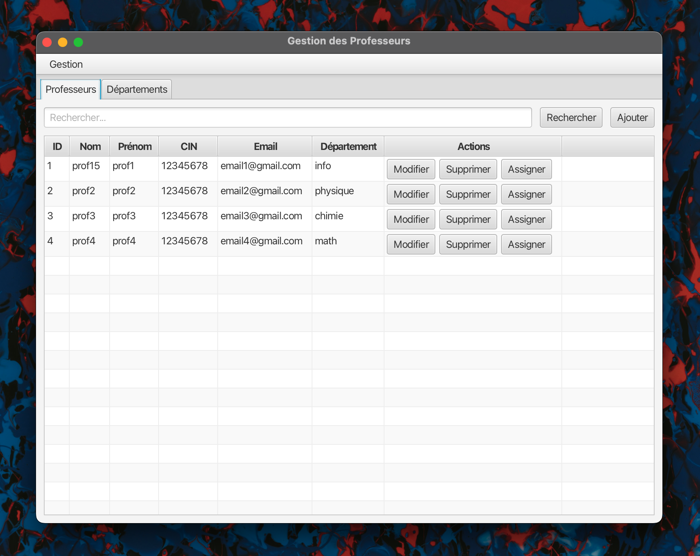
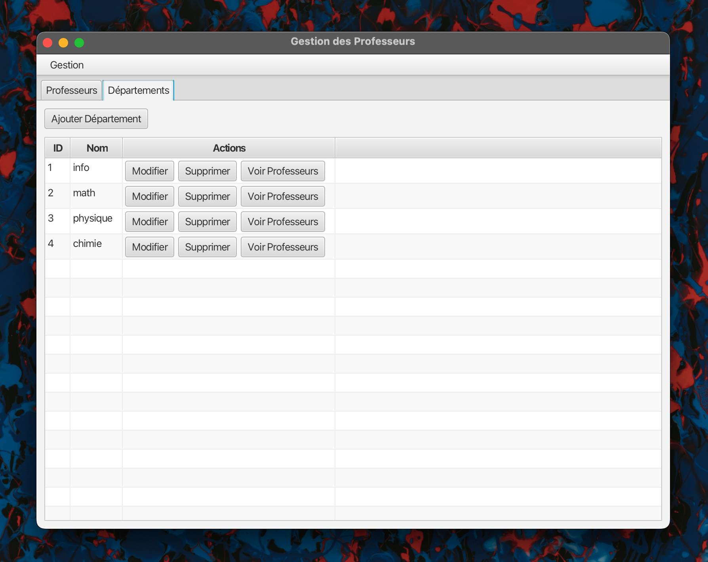
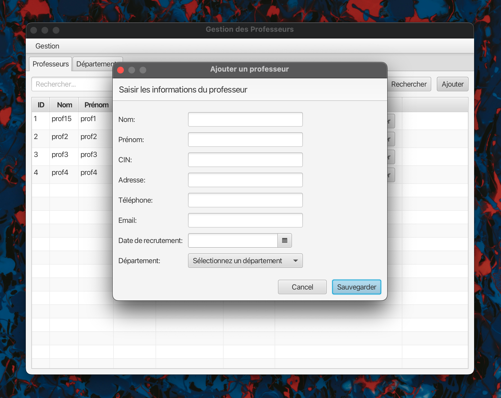
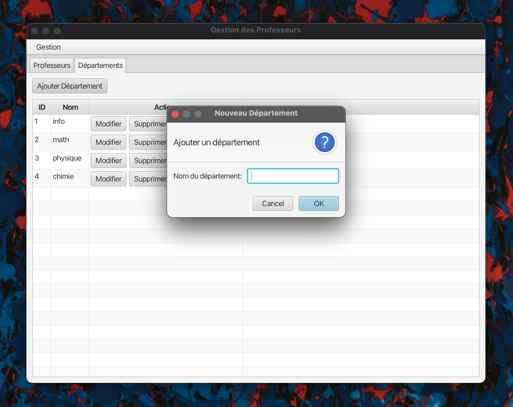
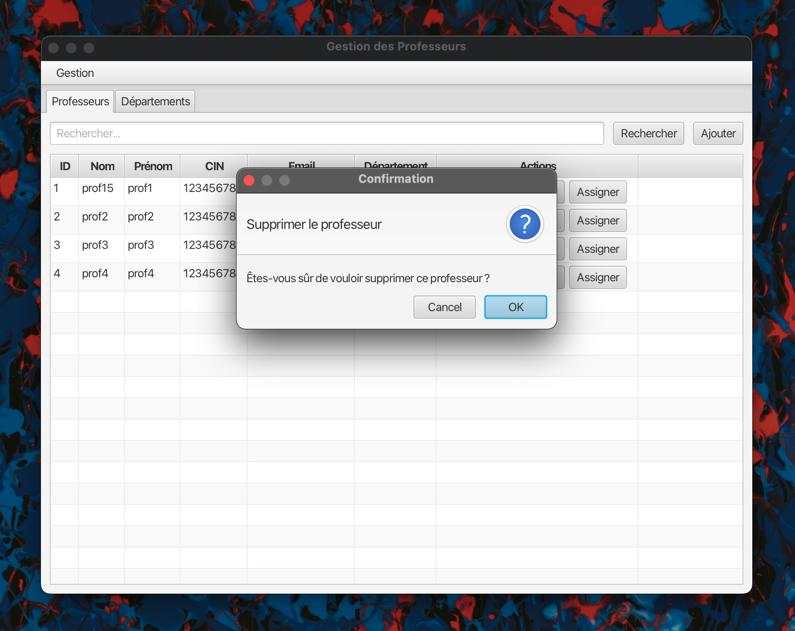
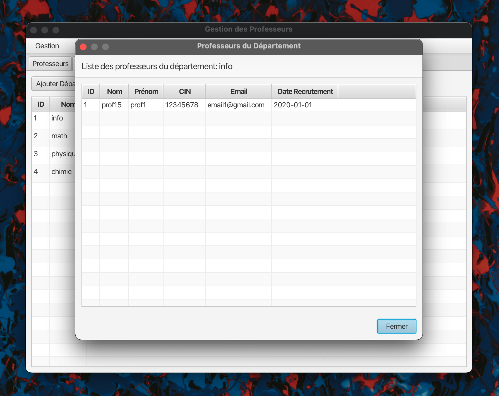
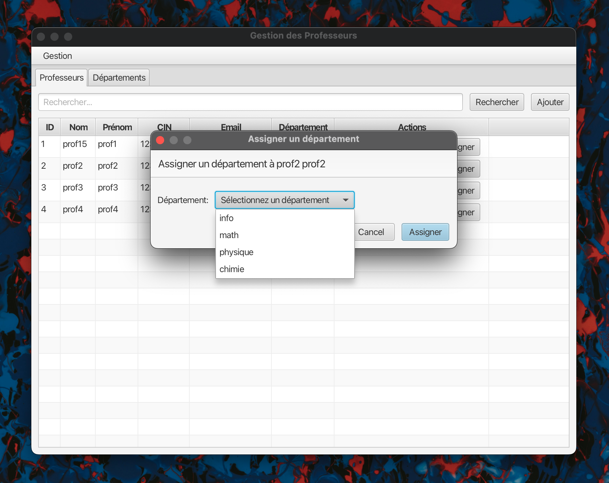

# TP5 Project Documentation

JavaFX Application for Managing Professors and Departments
This JavaFX application is designed to manage professors and departments within an educational institution. It provides functionalities for adding, editing, viewing, and deleting records of professors and departments.

## Result

## Models

### Professeur

The `Professeur` class represents a professor with various attributes:

- `id`: Unique identifier for the professor.
- `nom`: Last name of the professor.
- `prenom`: First name of the professor.
- `cin`: National identity card number.
- `adresse`: Address of the professor.
- `email`: Email address.
- `telephone`: Phone number.
- `dateRecrutement`: Date when the professor was recruited.
- `departementId`: Identifier for the department to which the professor belongs.

### Departement

The `Departement` class represents a department within the institution:

- `id`: Unique identifier for the department.
- `nom`: Name of the department.

## Business Logic

### IMetier Interface

The `IMetier` interface defines the operations related to the business logic for managing professors and departments:

#### Professeur Operations

- `List<Professeur> getAllProfesseurs()`: Retrieves all professors.
- `List<Professeur> searchProfesseurs(String keyword)`: Searches for professors using a keyword.
- `void addProfesseur(Professeur professeur)`: Adds a new professor.
- `void deleteProfesseur(int idProf)`: Deletes a professor by ID.
- `void updateProfesseur(Professeur professeur)`: Updates the details of a professor.

#### Departement Operations

- `void addDepartement(Departement departement)`: Adds a new department.
- `List<Departement> getAllDepartements()`: Retrieves all departments.
- `void deleteDepartement(int idDepart)`: Deletes a department by ID.
- `void updateDepartement(Departement departement)`: Updates the details of a department.
- `List<Professeur> getProfesseursByDepartement(int idDepart)`: Retrieves all professors belonging to a specific department.

### MetierImpl Class

The `MetierImpl` class is an implementation of the `IMetier` interface. It uses a database connection to perform CRUD operations.

#### Database Operations

- Uses `SingletonConnexionDB` for database connections.
- Implements all methods defined in the `IMetier` interface for managing professors and departments.
- Includes helper methods to extract entities from `ResultSet`.

## Database Connection

### SingletonConnexionDB Class

The `SingletonConnexionDB` class handles the database connection using the singleton design pattern:

- Provides a static method `getConnexion()` to retrieve the database connection.
- Ensures only one instance of the connection exists throughout the application lifecycle.

## Controllers

### MainController

The `MainController` class manages the primary view, which consists of a `TabPane`. It includes methods to switch between different tabs:

- `void showProfesseurs()`: Switches to the tab displaying professors.
- `void showDepartements()`: Switches to the tab displaying departments.

### ProfesseurController

The `ProfesseurController` class handles the UI logic for managing professors. It interacts with the `IMetier` service to perform CRUD operations and search functionality.

#### Key Methods

- `void initialize(URL url, ResourceBundle rb)`: Initializes the controller.
- `void setupTable()`: Configures the `professeurTable` columns and their data sources.
- `void loadProfesseurs()`: Loads the list of professors into the table.
- `void handleSearch()`: Searches for professors based on a keyword.
- `void handleAdd()`: Opens a dialog to add a new professor.
- `void handleEdit(Professeur professeur)`: Opens a dialog to edit an existing professor.
- `void handleDelete(Professeur professeur)`: Deletes the selected professor.
- `void handleAssign(Professeur professeur)`: Assigns a department to the selected professor.

### DepartementController

The `DepartementController` class manages the UI logic for departments. It interacts with the `IMetier` service to perform CRUD operations on departments.

#### Key Methods

- `void initialize(URL url, ResourceBundle rb)`: Initializes the controller.
- `void setupTable()`: Configures the `departementTable` columns and sets up action buttons.
- `void loadDepartements()`: Loads the list of departments into the table.
- `void handleAdd()`: Opens a dialog to add a new department.
- `void handleEdit(Departement departement)`: Opens a dialog to edit an existing department.
- `void handleDelete(Departement departement)`: Deletes the selected department.
- `void handleViewProfesseurs(Departement departement)`: Opens a dialog to view professors in the selected department.

## Application

### JavaFxApplication

The `JavaFxApplication` class is the main entry point for the JavaFX application. It extends the `Application` class from the JavaFX framework and overrides the `start` method to set up the primary stage and scene.

#### Key Methods and Components

- `public void start(Stage primaryStage)`: This method is called when the application is launched. It performs the following tasks:
    - Loads the FXML file: It uses the `FXMLLoader` class to load the `main-view.fxml` file. This file defines the layout of the main user interface using XML.
    - Creates the scene: It creates a new `Scene` instance with the loaded FXML layout.
    - Sets the stage: It sets up the primary stage (main window) of the application with a title ("Gestion des Professeurs") and the created scene.
    - Shows the stage: It makes the primary stage visible by calling `primaryStage.show()`.

- `public static void main(String[] args)`: This is the main method which serves as the entry point of the Java application. It launches the JavaFX application by calling the `launch` method. The `launch` method internally calls the `start` method defined above.

##### Example Breakdown

When the `JavaFxApplication` class is executed:

1. The `main` method is called, which in turn calls the `launch` method.
2. The `launch` method initializes the JavaFX environment and then calls the `start` method.
3. Inside the `start` method:
    - The `FXMLLoader` loads the `main-view.fxml` file.
    - A `Scene` object is created using the loaded layout.
    - The primary stage's title is set to "Gestion des Professeurs".
    - The scene is attached to the primary stage.
    - The primary stage is displayed.

This process sets up and displays the main window of the JavaFX application, providing the initial user interface for managing professors and departments.
