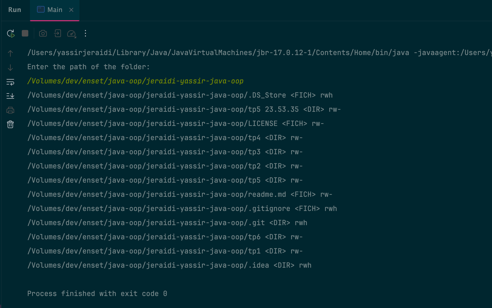
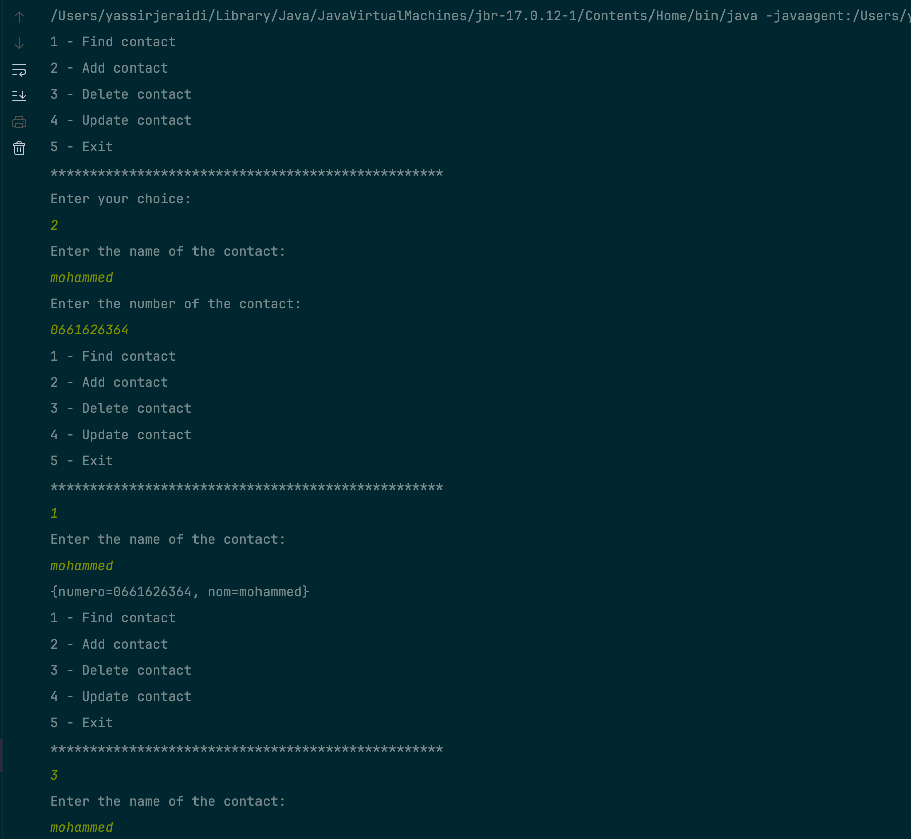
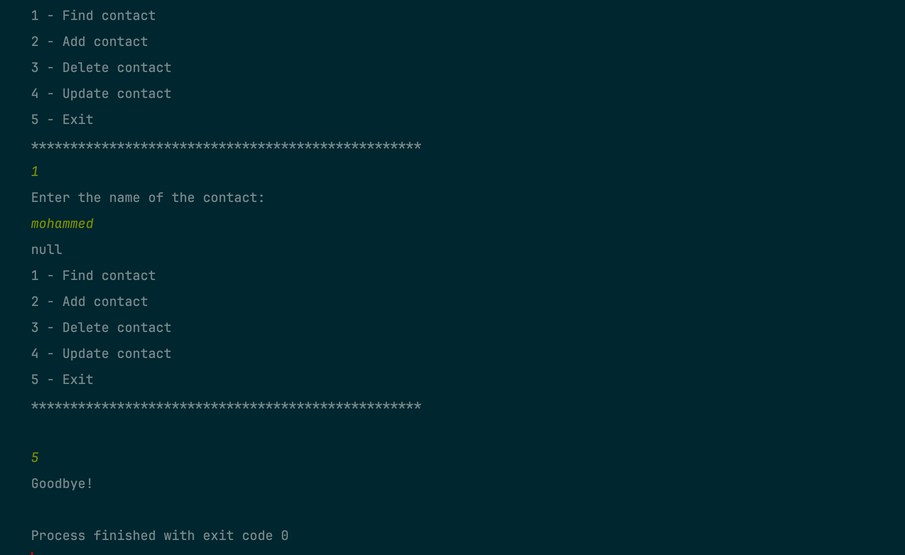
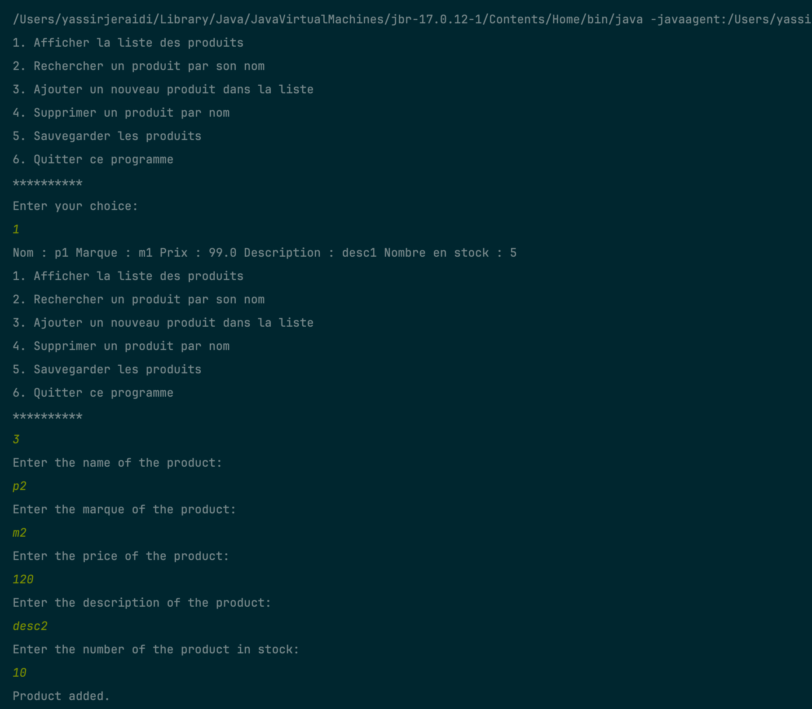
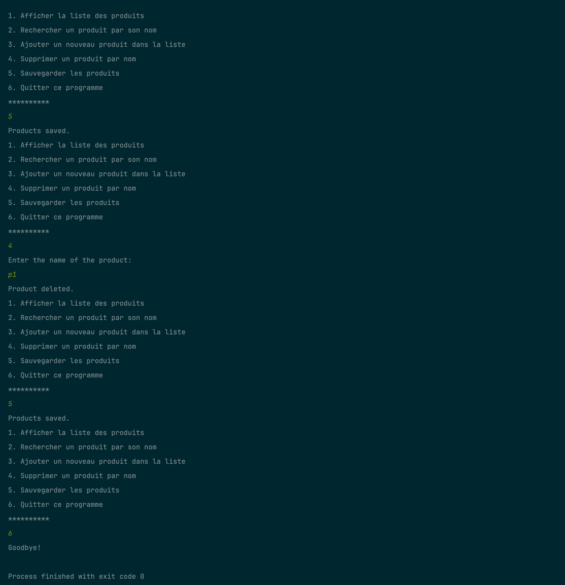

# Unified Java Exercises

This project is a collection of various Java exercises unified under a single entry point. It consists of a main Main class that orchestrates the execution of exercises from different packages.

## Table of Contents

- [Exercises](#exercises)
- [Main Entry Point](#main-entry-point)
- [Main Code Results](#main-code-results)
- [Exercises link](#exercises-link)
- [Prerequisites](#prerequisites)

## Exercises

- **Exercise 1**: 

## Main Entry Point

### Main

The central `Main` class is responsible for running all the exercises sequentially. It invokes the `main` method of each exercise.

```java
package com.tp6;

import java.io.IOException;

public class Main {
    public static void main(String[] args) throws IOException {
        System.out.println("Exercice 1:");
        com.tp6.ex1.Main.main(args);
        System.out.println("Exercice 2:");
        com.tp6.ex2.Main.main(args);
        System.out.println("Exercice 3:");
        System.out.println("Products Management :");
        com.tp6.ex3.app.ProduitApplication.main(args);
        System.out.println("Clients Management :");
        com.tp6.ex3.app.ClientApplication.main(args);
    }
}
```

### Main Code Results

# Exercise 1:

# Exercise 2:


# Exercise 3:



The message Process finished with exit code 0 indicates that the program terminated successfully without any unhandled exceptions.

## Exercises link

- [Exercise 1](src/main/java/com/tp6/ex1/readme.md)
- [Exercise 2](src/main/java/com/tp6/ex2/readme.md)
- [Exercise 3](src/main/java/com/tp6/ex3/readme.md)


### Prerequisites

- Java Development Kit (JDK) 17 or higher.
- IDE such as IntelliJ IDEA.

### Running the Program

1. Clone the repository to your local machine.
2. Open the project in your preferred IDE.
3. Compile and run the central `Main` class.
4. The program will sequentially execute each exercise: Notes Management System, Conjugation System, String Manipulation System, and Letter Occurrences System.
