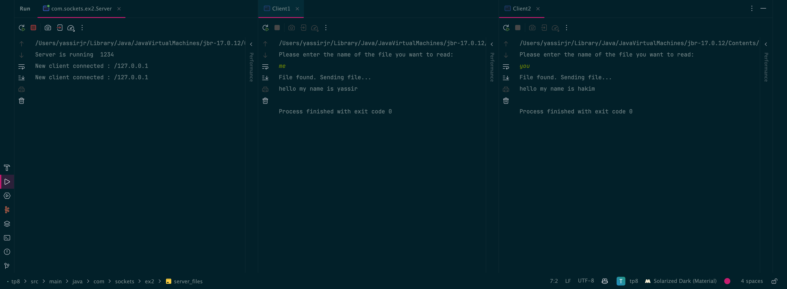

# Unified Java Exercises

This project demonstrates a comprehensive exploration of socket programming in Java, featuring multiple practical
implementations that showcase client-server communication techniques.

## Table of Contents

- [Main Code Results](#main-code-results)
- [Exercises link](#exercises-link)
- [Prerequisites](#prerequisites)

### Main Code Results

# Exercise 1:

# Exercise 2:

The message Process finished with exit code 0 indicates that the program terminated successfully without any unhandled
exceptions.

## Exercises link

- [Exercise 1](src/main/java/com/sockets/ex1/readme.md)
- [Exercise 2](src/main/java/com/sockets/ex2/readme.md)

### Prerequisites

- Java Development Kit (JDK) 17 or higher.
- IDE such as IntelliJ IDEA.

### Running the Program

1. Clone the repository to your local machine.
2. Open the project in your preferred IDE.
3. Compile and run the central `Main` class.
4. The program will sequentially execute each exercise: Notes Management System, Conjugation System, String Manipulation
   System, and Letter Occurrences System.
